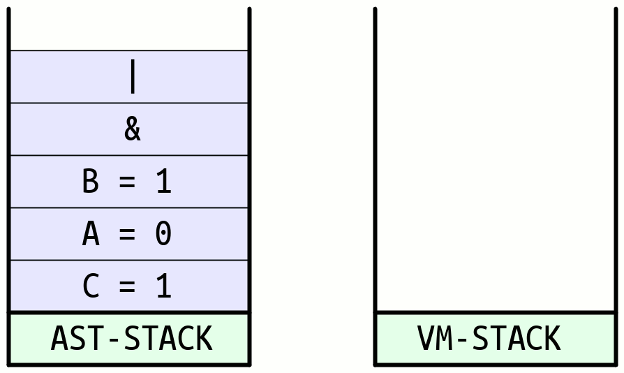
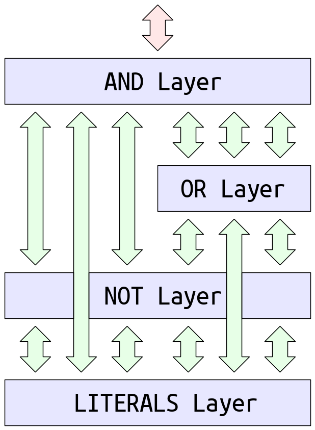

% A SAT Solver Implementation
% Davide Paro;
% May 2018

Parsing
=======
1. Il primo passo consiste nella **tokenizzazione** della formula.
   Ogni singolo carattere viene raggruppato in "tokens" secondo
   le regole sintattiche definite dal linguaggio. 

2. Una volta generati i "tokens", si procede alla conversione
   della formula dalla forma __infissa__ (piu' comoda agli umani)
   in una forma __prefissa__ (LISP Notation).

          (A & B) | C     -->    (| (& A B) C)
  
3. Si fa uso dell'algoritmo **Shunting-Yard** fortemente customizzato con
   estensioni per risolvere il problema in questione. In base
   a regole di precedenza degli operatori e alle regole sintattiche
   definite per il linguaggio verra' generata la notazione prefissa
   appropriata.
   

AST Generation
==============
1. Una volta "parsata" la formula in forma prefissa si
   genera l'albero di sintassi <**AST**>. L'albero
   di sintassi verra' implementato semplicemente con
   un semplice STACK.
2. Segue un analisi semantica e di validita' della formula
   presente nell'AST. Se erronea, viene rifiutata.

          A & | B   e' una formula mal formata -> errore

3. Una volta verificata la validita' della formula
   se ne estraggono i vari simboli/letterali/identificatori
   e si usano per costruire una **Symbol Table**.
   (Esattamente come un compilatore)
       
          FORMULA:      (| (& A B) C) 
    

Bruteforce solver
=================
> Genera una truth table

1. In base al numero di letterali trovati all'interno della
   formula si procede alla generazione di 2^n possibili combinazioni
   (dove n e' il numero di letterali)
2. Grazie al fatto di aver rappresentato l'AST con un semplice stack
   ci permette di implementare un risolutore che sostanzialmente
   lavora come una **stack-virtual-machine**.
   Si procede dal fondo dello stack per ogni letterale/costante
   si "pusha" il valore in un altro stack **(Virtual Machine Stack)**
   e per ogni operatore si fa il "pop" del numero necessario di operandi
   e si "ripusha" il risultato.
   Alla fine della "evaluation" dell'intero AST in caso di formula ben formata
   sullo stack delle computazioni rimane solamente un elemento:
   il risultato della computazione dell'intera formula.

        FORMULA:      (| (& A B) C)
        ASSEGNAMENTO: [A = 0, B = 1, C = 1]
        
   

{{ DEMO }}

Performance Analysis
=====================
* Un risolutore basato su bruteforce comincia a diventare impraticabile
  gia' con 16 letterali.
  
          Esempio: "a1 | a2 | .... | an"

  N: Numero letterali        Tempo di computazione
  -------------------        ---------------------
                   15                 6 secondi
                   16                12 secondi
                   17                27 secondi
                   18                57 secondi
                   19               121 secondi

* Il tempo di computazione diventa piu' del doppio per ogni letterale
* Il tempo di computazione peggiora ulteriormente se sono presenti
  sotto-formule coincidenti. Esse vengono valutate piu' volte dal
  risolutore

  [**Bruteforce Unusable Output**](./imgs/bruteforce_unusable_output.html){target="_blank"}

A Better Approach
=================
* Se ci interessa solamente dimostrare la soddisfacibilita' di una
  formula logica si puo' utilizzare un algoritmo che fa uso di 
  backtracking.
* **SODDISFACIBILITA'**: Si vuole dimostarre se la formula presenta
  almeno un **interpretazione** (un particolare assegnamento per i letterali) 
  che rende la formula _vera_.
* **INSODDISFACIBILITA'**: Si vuole dimostrare che indipendentemente
  dall'assegnamento dei letterali la formula risulta sempre _falsa_.
* **VALIDITA' DI UNA TESI**: Equivale a dimostrare che la tesi
  negata risulta insoddisfacibile. (Dimostrazione per assurdo) 

DPLL Algorithm
==============
* Introdotto nel 1962 da Martin Davis, George Logemann, Donald W. Loveland
* Algoritmo classico, e usato come base per algoritmi migliori
  che si sono evoluti da DPLL. Esempio:

        Chaff, zChaff, GRASP
  
  Sono delle implementazioni piu' performanti e raffinate di **DPLL**
  
  [__Wikipedia Link__](https://en.wikipedia.org/wiki/DPLL_algorithm)
  
  
~~~~~~~~~~~~~~~~~~~~~~~~~~~~~~~~~~~~~~~~~~~~~~ruby
     Algorithm DPLL
       Input: A set of clauses K.
       Output: A Truth Value.
     ----------------------------------------------
     function DPLL(K) {
        if K is a consistent set of literals
            then return true;
        if K contains an empty clause
            then return false;
        for every unit clause {l} in K
           K ← unit-propagate(l, K);
        for every literal l that occurs pure in K
           K ← pure-literal-assign(l, K);
        l ← choose-literal(K);
        return DPLL(K and {l}) or DPLL(K and {not(l)});
     }
~~~~~~~~~~~~~~~~~~~~~~~~~~~~~~~~~~~~~~~~~~~~~~~~~~~

CNF Conversion
==============
1. Si trasformano tutti gli operatori come funzioni di
   solamente __AND, OR, NOT__
        
        a ^ b     =   (!a | !b) & (a | b)
        a -> b    =   !a | b
        a <-> b   =   !(a ^ b)  =  !((!a | !b) & (a | b))
        
   Dalla teoria sappiamo che qualsiasi circuito/formula-logica
   puo' essere sintetizzata solamente con la combinazione di 
   AND, OR, NOT.
   
       Esempio: A <-> B
       
   
   
2. Si applica De-Morgan ricorsivamente in modo da "spingere le negazioni in basso".
   Alla fine dell'applicazione di De-Morgan si avra' una formula dipendentemente
   da 

        a1, a2, ...., an, !a1, !a2, ...., !an
        
   In cui le negazioni compaiono solamente precedendo gli input e non "in mezzo alla formula"
    
   

3. Si applica una eliminazione della doppia negazione.
   
            !!  a  =  a
            !!! a  = !a
            
   

4. Si distribuisce rispetto all'operatore __OR__:

        P | ( Q & R )   --->   ( P | Q ) & ( P | R )
   
   
       Notare la ridondanza di alcuni nodi.

5. Alla fine si ottiene una formula a clausole, formate dall'ultimo strato
   da AND, il secondo strato da OR, e il terzo stato da NOTs.
   
   
   
   I nodi ORs rappresentano indecisione sul valore di input, mentre
   le AND affermano decidibilita sull'input.
   
       Esempio: A & B  e' reversibile
                L'unico modo per avere **true** in output e che in input 
                sia **A** che **B** siano posti ad **true**
   
   {{IMMAGINE DI ESEMPIO}}
   
   
DPLL Explanation
================
DPLL Procede nel seguente modo:

1. Analizza la formula e verifica la presenza di clausole unitarie,
   ovvero clausole il cui assegnamento e' forzato per fare in modo
   che la formula sia vera. Esempio:
       
           A & !B & (C | D)   A deve necessariamente essere vera
                              B deve necessariamente essere falsa

2. Trovate tutte le clausole unitarie si forza loro l'assegnamento
   corretto e si riduce l'albero di sintassi (UNIT PROPAGATION)
       
           A & !B & (C | D)  -->   C | D   con assegnamento A = 1, B = 0
           F & 1             -->   F
           G | 1             -->   1
   
   > Lo unit propagation costituisce la parte piu' complessa
   > e il cuore di tutto l'algoritmo DPLL
           
3. Gli operatori **OR** denotano indecisione sul valore dell'input.
   DPLL continua prendendo un letterale a caso, assegnando
   ad esso rispettivamente il valore __true__ riduce l'AST
   e chiama ricorsivamente di nuovo DPLL. Se la chiamata ricorsiva
   porta ad insoddisfacimento alla formula, DPLL riassegna al
   letterale il valore __false__ e riprova. (BACKTRACKING).
       
4. Prima o poi l'albero si sara' ridotto banalmente a:
        
          1) true     sicuramente la formula e' soddisfacibile
          2) false    sicuramente la formula e' insoddisfacibile
          3) [-]      (formula vuota) insoddisfacibile
       
5. Le chiamate ricorsive terminano non appena si raggiunge il soddisfacimento.
   La insoddisfacibilita' della formula invece porta DPLL a ritentare di nuovo.
   
6. Se DPLL termina tutti gli assegnamenti sui letterali possibili senza raggiungere
   il soddisfacimento della formula, allora la formula e' insoddisfacibile.

{{ IMMAGINE }}
{{ DEMO }}

Proving Theorems with DPLL
==========================
* Con DPLL e' possibile verificare la tautologia di una formula
  e di conseguenza dimostrare teoremi.
* Il modo per dimostrare un teorema e' prendere la formula
  originale aggiungere un nodo **NOT** ovvero negarla e valutare
  DPLL su di essa. 
  
  **(*DIMOSTRAZIONE PER ASSURDO*)**
  
  Se DPLL applicato su questa nuova formula porta sempre a
  insoddisfacimento, allora la formula e' sicuramente una tautologia,
  e quindi il teorema e' dimostrato.
  Se invece DPLL trova un soddisfacimento per questa formula
  allora sicuramente la tesi non e' valida.
  L'algoritmo in questo caso riporta l'assegnamento dei letterali
  cha hanno causato la non validita' della tesi.
  
{{IMMAGINE}}
{{DEMO}}

Performance Analysis
====================

Improving Performance
=====================

