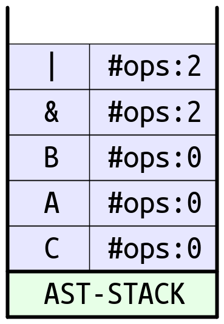
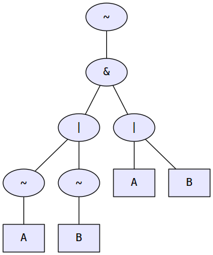
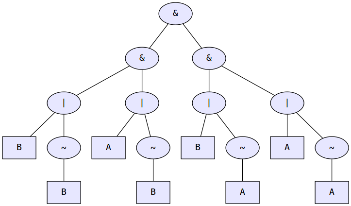
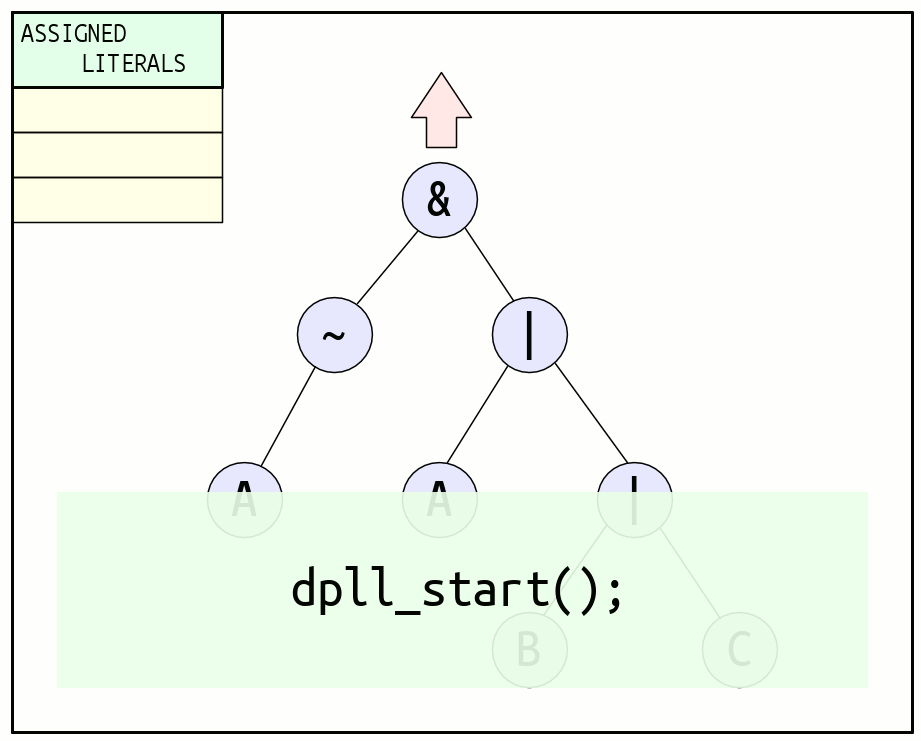

% A SAT Solver Implementation
% Davide Paro;
% May 2018

Content
=======
* Introduzione a risolutori `SAT` for problemi
  **NP-complete**
* Discussione di algoritmi classici per la risoluzione
* Discussione di algoritmi che compongono lo
  stato dell'arte dei risolutori piu' moderni
* Presentazione di un semplice risolutore
  basato su **bruteforce** e ricerca con backtracking
  **DPLL**.
* Analisi a grandi linee delle performance e dettagli applicativi

Parsing
=======
1. Il primo passo consiste nella **tokenizzazione** della formula.
   Ogni singolo carattere viene raggruppato in "tokens" secondo
   le regole sintattiche definite dal linguaggio. 

2. Una volta generati i "tokens", si procede alla conversione
   della formula dalla forma __infissa__ (piu' comoda agli umani)
   in una forma __prefissa__ (LISP Notation).

          (A & B) | C     -->    (| (& A B) C)
  
3. Si fa uso dell'algoritmo **Shunting-Yard** fortemente customizzato con
   estensioni per risolvere il problema in questione. In base
   a regole di precedenza degli operatori e alle regole sintattiche
   definite per il linguaggio verra' generata la notazione prefissa
   appropriata.
   

AST Generation
==============
1. Una volta "parsata" la formula in forma prefissa si
   genera l'albero di sintassi <**AST**>. L'albero
   di sintassi verra' implementato semplicemente con
   un semplice STACK.
2. Segue un analisi semantica e di validita' della formula
   presente nell'AST. Se erronea, viene rifiutata.

          A & | B   e' una formula mal formata -> errore

3. Una volta verificata la validita' della formula
   se ne estraggono i vari simboli/letterali/identificatori
   e si usano per costruire una **Symbol Table**.
   (Esattamente come un compilatore)
       
          FORMULA:      (| (& A B) C) 
    

BruteForce Solver (BF)
======================
> Genera una truth table

1. In base al numero di letterali trovati all'interno della
   formula si procede alla generazione di 2^n possibili combinazioni
   (dove n e' il numero di letterali)
2. Grazie al fatto di aver rappresentato l'AST con un semplice stack
   ci permette di implementare un risolutore che sostanzialmente
   lavora come una **stack-virtual-machine**.
   Si procede dal fondo dello stack per ogni letterale/costante
   si "pusha" il valore in un altro stack **(Virtual Machine Stack)**
   e per ogni operatore si fa il "pop" del numero necessario di operandi
   e si "ripusha" il risultato.
   Alla fine della "evaluation" dell'intero AST in caso di formula ben formata
   sullo stack delle computazioni rimane solamente un elemento:
   il risultato della computazione dell'intera formula.

        FORMULA:      (| (& A B) C)
        ASSEGNAMENTO: [A = 0, B = 1, C = 1]
        
   

{{ DEMO }}

BF: Performance Analysis
========================
* Un risolutore basato su bruteforce comincia a diventare impraticabile
  gia' con 16 letterali.
  
          Esempio: "a1 | a2 | .... | an"

  N: Numero letterali        Tempo di computazione
  -------------------        ---------------------
                   15                 6 secondi
                   16                12 secondi
                   17                27 secondi
                   18                57 secondi
                   19               121 secondi

* Il tempo di computazione diventa piu' del doppio per ogni letterale
* Il tempo di computazione peggiora ulteriormente se sono presenti
  sotto-formule coincidenti. Esse vengono valutate piu' volte dal
  risolutore

* Inoltre quando il numero di letterali inizia ad essere consistente
  l'output generato da Bruteforce risulta pressoche' inutilizzabile.

  [**Bruteforce Unusable Output**](./imgs/bruteforce_unusable_output.html){target="_blank"}

A Better Approach
=================
* Se ci interessa solamente dimostrare la soddisfacibilita' di una
  formula logica si puo' utilizzare un algoritmo che fa uso di 
  backtracking.
* **SODDISFACIBILITA'**: Si vuole dimostarre se la formula presenta
  almeno un **interpretazione** (un particolare assegnamento per i letterali) 
  che rende la formula _vera_.
* **INSODDISFACIBILITA'**: Si vuole dimostrare che indipendentemente
  dall'assegnamento dei letterali la formula risulta sempre _falsa_.
* **VALIDITA' DI UNA TESI**: Equivale a dimostrare che la tesi
  negata risulta insoddisfacibile. (Dimostrazione per assurdo) 

DPLL Algorithm
==============
* Introdotto nel 1962 da Martin Davis, George Logemann, Donald W. Loveland
* Algoritmo classico, e usato come base per algoritmi migliori
  che si sono evoluti da DPLL. Esempio:

        Chaff, zChaff, GRASP
  
  Sono delle implementazioni piu' performanti e raffinate di **DPLL**
  
  [__Wikipedia Link__](https://en.wikipedia.org/wiki/DPLL_algorithm)
  
  
~~~~~~~~~~~~~~~~~~~~~~~~~~~~~~~~~~~~~~~~~~~~~~ruby
     Algorithm DPLL
       Input: A set of clauses K.
       Output: A Truth Value.
     ----------------------------------------------
     function DPLL(K) {
        if K is a consistent set of literals
            then return true;
        if K contains an empty clause
            then return false;
        for every unit clause {l} in K
           K ← unit-propagate(l, K);
        for every literal l that occurs pure in K
           K ← pure-literal-assign(l, K);
        l ← choose-literal(K);
        return DPLL(K and {l}) or DPLL(K and {not(l)});
     }
~~~~~~~~~~~~~~~~~~~~~~~~~~~~~~~~~~~~~~~~~~~~~~~~~~~

CNF Conversion
==============
1. Si trasformano tutti gli operatori come funzioni di
   solamente __AND, OR, NOT__
        
        a ^ b     =   (!a | !b) & (a | b)
        a -> b    =   !a | b
        a <-> b   =   !(a ^ b)  =  !((!a | !b) & (a | b))
        
   Dalla teoria sappiamo che qualsiasi circuito/formula-logica
   puo' essere sintetizzata solamente con la combinazione di 
   AND, OR, NOT.
   
       Esempio: A <-> B
       
   
   
2. Si applica De-Morgan ricorsivamente in modo da "spingere le negazioni in basso".
   Alla fine dell'applicazione di De-Morgan si avra' una formula dipendentemente
   da 

        a1, a2, ...., an, !a1, !a2, ...., !an
        
   In cui le negazioni compaiono solamente precedendo gli input e non "in mezzo alla formula"
    
   

3. Si applica una eliminazione della doppia negazione.
   
            !!  a  =  a
            !!! a  = !a
            
   

4. Si distribuisce rispetto all'operatore __OR__:

        P | ( Q & R )   --->   ( P | Q ) & ( P | R )
   
   
       Notare la ridondanza di alcuni nodi.

5. Alla fine si ottiene una formula a clausole, formate dall'ultimo strato
   da AND, il secondo strato da OR, e il terzo stato da NOTs.
   
   
   
   I nodi ORs rappresentano indecisione sul valore di input, mentre
   le AND affermano decidibilita sull'input.
   
       Esempio: A & B  e' reversibile
                L'unico modo per avere **true** in output e che in input 
                sia **A** che **B** siano posti ad **true**
   
   {{IMMAGINE DI ESEMPIO}}
   
Why CNF Form?
=============
* La formula a CNF essendo formata da operatori `&` presenti solo in
  "cima", permette di dividere la verifica dell'intera soddisfacibilita'
  della formula nella verifica seperata della soddisfacibilita' delle
  singole clausole (Minore branching factor e parallelizzabile).
  
  Infatti l'operatore `&` e' una funzione iniettiva sotto le ipotesi di imporre
  che l'output deve essere `1`. Cio' permette di propagare
  il valore ai sotto-alberi che formano la clausola.
   
   
DPLL Explanation
================
DPLL Procede nel seguente modo:

1. Analizza la formula e verifica la presenza di clausole unitarie,
   ovvero clausole il cui assegnamento e' forzato per fare in modo
   che la formula sia vera. Esempio:
       
           A & !B & (C | D)   A deve necessariamente essere vera
                              B deve necessariamente essere falsa

2. Trovate tutte le clausole unitarie si forza loro l'assegnamento
   corretto e si riduce l'albero di sintassi (UNIT PROPAGATION)
       
           A & !B & (C | D)  -->   C | D   con assegnamento A = 1, B = 0
           F & 1             -->   F
           G | 1             -->   1
   
   > Lo unit propagation costituisce la parte piu' complessa
   > e il cuore di tutto l'algoritmo DPLL
           
3. Gli operatori **OR** denotano indecisione sul valore dell'input.
   DPLL ora deve prendere una **decisione**.
   DPLL continua prendendo un letterale a caso, assegnando
   ad esso rispettivamente il valore __true__ riduce l'AST con
   un **unit-propagate**
   e chiama ricorsivamente DPLL di nuovo. Se la chiamata ricorsiva
   porta ad insoddisfacimento alla formula, DPLL riassegna al
   letterale il valore __false__ e riprova. (BACKTRACKING).
       
4. Prima o poi l'albero si sara' ridotto banalmente a:
        
          1) true     sicuramente la formula e' soddisfacibile
          2) false    sicuramente la formula e' insoddisfacibile
          3) [-]      (formula vuota) insoddisfacibile
       
5. Le chiamate ricorsive terminano non appena si raggiunge il soddisfacimento.
   La insoddisfacibilita' della formula invece porta DPLL a ritentare di nuovo.
   
6. Se DPLL termina tutti gli assegnamenti sui letterali possibili senza raggiungere
   il soddisfacimento della formula, allora la formula e' insoddisfacibile.


{{ IMMAGINE }}
{{ DEMO }}


DPLL Full Example
=================
## Formula:
~~~
~A & ( A | B | C )
~~~
    
   
    
Proving Theorems with DPLL
==========================
* Con DPLL e' possibile verificare la tautologia di una formula
  e di conseguenza dimostrare teoremi.
* Ampio utilizzo nell'ambito **EDA** (Electronic Design Automation)
  per la sintetizzazzione e verifica di correttezza di circuiti logici.
* Il modo per dimostrare un teorema e' prendere la formula
  originale aggiungere un nodo **NOT** ovvero negarla e valutare
  DPLL su di essa. 
  
  **(*DIMOSTRAZIONE PER ASSURDO*)**
  
  Se DPLL applicato su questa nuova formula porta sempre a
  insoddisfacimento, allora la formula e' sicuramente una tautologia,
  e quindi il teorema e' dimostrato.
  Se invece DPLL trova un soddisfacimento per questa formula
  allora sicuramente la tesi non e' valida.
  L'algoritmo in questo caso riporta l'assegnamento dei letterali
  cha hanno causato la non validita' della tesi.
  
{{IMMAGINE}}
{{DEMO}}

DPLL & BF Comparison
====================
* Ovviamento il tempo di computazione rispetto a un algoritmo 
  bruteforce e' **DRASTICAMENTE** migliorato.

            Esempio di prima: "a1 | a2 | .... | an"

  N: Numero letterali        Tempo Computazione **BF**      Tempo Computazione **DPLL**
  -------------------        -------------------------      ---------------------------
                   15                 6 secondi                       < 1 milli-secondo
                   16                12 secondi                       < 1 milli-secondo
                   17                27 secondi                       < 1 milli-secondo
                   18                57 secondi                       < 1 milli-secondo
                   19               121 secondi                       < 1 milli-secondo

DPLL & TP: Curiosities
======================
* Per esempio questa formula casuale:
          
          a == b ^ c -> d | e <-> f ^ g & h 
                 | j | k & l > n | m & o ^ q
  
  stressa maggiormente il risolutore `DPLL`, infatti per
  arrivare ad una soluzione si ha rispettivamente che:
                 
         DPLL impiega :  14 milli-secondi
         TP impiega   : < 1 milli-secondo

* Sulla stessa formula `DPLL` e `TP` hanno tempi di computazione
  completamente diversi ( + di 1 ordine di grandezza).
  
* **Se e solo se _ASSUMIAMO_** l'euristica che la formula non possa 
  assumere **SEMPRE il valore falso**,
  allora possiamo concludere che se `TP` dimostra la validita' del teorema
  allora sicuramente si ha la garanzia dell'esistenza di una interpretazione
  in cui la formula assume il valore `true`.
  Se `TP` arriva all'insoddisfacimento (siccome abbiamo escluso caso
  formato da soli 0), possiamo comunque concludere che la formula
  fornisce almeno un valore `true`.
  
* Se `DPLL` raggiunge un insoddisfacimento allora sicuramente la
  formula non e' una tautologia.
  
* Se `DPLL` raggiunge un soddisfacimento allora, la formula
  potrebbe o no essere una tautologia.
  
 
 
 
* Questa **EURISTICA** ci permette di ottimizzare l'algoritmo e
  di lanciare in parallelo (su 2 Thread diversi) sia `DPLL` sia
  `TP`, se `TP` arriva prima ad una soluzione ci permette di
  diminuire i tempi di computazione al **MINIMO** tra rispettivamente
  i tempi di computazione dei singoli algoritmi.

* Questa **EURISTICA** per ovvie ragioni non e' ammissibile
  per formule composte da 1 singolo letterale, ma al
  crescere del numero di letterali che compongono la formula
  l'euristica tende sempre di piu' ad essere ammissibile.
  
* L'uso di questa **EURISTICA** tuttavia non garantisce la completezza
  e la validita' della soluzione.
  
DPLL: Performance Analysis
==========================
* **DPLL-unit-propagate** costituisce la parte piu' corposa e il cuore
  dell'intero algoritmo. Nella nostra implementazione occupa
  circa il `50 ~ 70%` dell'`execution-time`. Nella nostra implementazione
  l'AST viene copiato e fisicamente ridotto, eliminando nodi nella
  fase di `unit-propagate`. Cio' garantisce una piu' facile
  implementazione di determinare che cosa sia una **clausola
  unitaria** ma comporta dei costi non trascurabili in performance.
* Un `>= 90%` di tempo di computazione speso in `unit-propagate` e' un
  valore tipico per implementazioni `DPLL` che non fanno uso
  di **duplicazione** dell'`AST`.

* **BAD!**: `dpll-unit-propagate` non e' "lavoro" **utile**
  alla determinazione della soluzione. E' solo **book-keeping**
  che deve essere svolto per fare funzionare l'algoritmo,
  e' solo una ricostruzione dell'AST che mantiene equivalenza
  semantica, e non porta `DPLL` ad avvicinarsi ad una soluzione.

  Non si riesce a fare molto meglio di cosi'.

* Nella nostra implementazione si duplica, l'`AST`
  prima di ogni chiamata ricorsiva. Cio' garantisce un
  backtracking con performance instantanee (Se la formula
  porta ad insoddisfaccimento semplicemente `free` l'AST
  e ritorna al chiamante che ha una copia dell'albero propria).
  Questo tuttavia comporta consumo di memoria esponenziale,
  e l'interprete potrebbe diventare impraticabile per la
  sintetizzazione di circuiti elettronici in cui compaiono
  alberi di formule con elevato grado di branching.
  Sicuramente sarebbe un punto da migliorare nell'implementazione
  del nostro risolutore per renderlo `industrial-strength`.
  
~~~~~~~~~c
  /* F1 */ a == b ^ c -> d | e <-> f ^ g & h | j 
                   | k & l > n | m & o ^ q
  
  /* F2 */ a == b ^ c -> d | e <-> f ^ g & h | j 
                   | k & l > n | m & o ^ q ~& z0
  
  /* F3 */ a == b ^ c -> d | e <-> f ^ g & h | j 
                   | k & l > n | m & o ^ q ~& z0 ^ z1 == z2
~~~~~~~~~

  | Formula | Memory Consumption |
  |---------|--------------------|
  |  F1     |  4.7 MegaBytes     |
  |  F2     |  7.68 MegaBytes    |
  |  F3     |  96.20 MegaBytes   |

  Si nota palesemente la dipendenza dal branching factor dell' `AST`.
  Operatori come `XOR (^)` e `IS EQUAL (==)` tendono ad essere piu'
  dispendiosi in termini di branching factor rispetto ad operatori
  come `OR (|)` e `AND (&)`.

* **Soluzione**: Invece di duplicare l'`AST`, nella
  fase di iterazione per `unit-propagate`, si **marcano**
  i nodi con dei `flags` (**mark & sweep**).
  Maggiore difficolta' di `debugging`,
  e non didattico per la comprensione del problema e
  dell'algoritmo.

zChaff: State of the Art DPLL-Derived Implementation
======================================================
* **PERFORMANCE** -> `10x ~ 200x` speedup rispetto a DPLL
  per problemi di soddisfacimento piu' grandi.

* Per evitare grossi costi di computazione nella
  fase di backtracking,
  si tiene traccia di una lista di **asserting-clauses**.
  Una clausole e' `clause asserted` se tutti i letterali che la
  compongono assumono valore `0` ad esclusione di 1 solo letterale
  che assumera valore `1`.
  ```
  a0 = 0; a1= 0; .... ai = 1; ....; an = 0;
  ```
  Dove `ai` e' il generico letterale `i` presente all'interno della formula.
  
  Fa uso della cosidetta `Two-Watched Literals Rule`.
  
  **IDEA**: Per ogni clausola si tengono "sott'occhio" due letterali,
  finche', questi due letterali non vengono assegnati o a loro volta soddisfatti,
  la clausola non puo' produrre uno `unit-propagation`.

  Solo quando uno dei due letterali viene posto a `0` che la clausola
  deve essere analizzata con dettaglio. Se:
  
  - E' presente un'altro letterale non settato e non "watched",
    si comincia a tenere "d'occhio" quest'ultimo.
  
  - Se e' presente un letterale soddisfatto nella clausola, non
    c'e' bisogno di alcuna particolare computazione.
  
  - Se non e' presente alcun letterale soddisfatto, allora la clausola
    e' pronta ad essere `unit-propagated`.
   
  **SCOPO**: Ridurre lo **unit-propagation** che e' la parte
  computazionalmente piu' dispendiosa nella risoluzione di un problema `SAT`.
  
* **NOTA**: In `zChaff` l'**undo** di un assegnamento non e' costoso in termini
  computazionali
  
zChaff: Variable State Independent Decaying Sum
===============================================
* A differenza di `DPLL`, il quale quando non sono presenti clausole unitarie
  adotta una metodologia di assegnamento randomico,
  `zChaff` utilizza delle tecniche con **euristica**
  per determinare l'assegnamento migliore da fare nel passo successivo.

1. Ad ogni letterale viene associato un contatore inizializzato a `0`
2. Quando una clausola viene aggiunta al database, il contatore
   associato ad ogni letterale presente nella clausola viene incrementato di `1`
3. Nella fase di decisione del letterale da assegnare, viene
   scelto il letterale che presenta un contatore con valore piu' **alto**
4. Eventuali vincoli vengono rimossi randomicamente
5. Periodicamente si dividono tutti i contatori per una `costante`.

* **IDEA**: Concentrare i tempi di computazione solamente su clausole
  che sono state provate insoddisfacibili **recentemente**.
 
  > This speedup is not the result of sophisticated learning strategies for 
  > pruning  the  search  space,  but  rather,  of  efficient engineering of
  > the   key   steps   involved   in   the   basic   search   algorithm.
  > Specifically, this speedup is derived from:
  > - a highly optimized BCP algorithm, and
  > - a  decision  strategy  highly  optimized  for  speed,  as well as 
  >   focused on recently added clauses


Conflict-Driven and Satisfiability-Directed Learning
====================================================
* Si fanno uso di tecniche di apprendimento. Sotto
  particolari condizioni si aggiungono ulteriori clausole
  al **clause-database** che costituisce
  la **knowledge-base** del risolutore.
  Lo scopo e' ridurre il fattore di ramificazione che deve essere eplorato
  prima di arrivare alla soddisfacibilita'.
  Oltretutto fa uso di **non-chronological backtracking**.
  (**NB**: In DPLL l'ordine di backtracking e' deciso
           dallo stack di ricorsione )

* Mantiene in memoria un grafo dell'implicazioni
  che viene modificato durante la fase di risoluzione.
  Ogni **nodo** rappresenta un assegnamento ad una
  variabile. Ogni **ramo** incidente in un dato nodo
  rappresenta il **motivo** che ha portato a tale 
  assegnamento. Quando si arriva ad un conflitto
  di assegnamento il grafo viene analizzato per capire
  il motivo del conflitto, e conseguentemente
  evitare in futuro di commettere lo stesso errore
  di assegnamento che porterebbe inevitavibilmente
  ad un insoddisfacimento della formula.


Future Work
===========
* Riscrittura `DPLL` per renderlo meno **memory-hungry**.
* Aggiunta nel REPL per supporto di semplici definizioni di liste

~~~~~
    uomini = [marco, luca, giovanni, ...]
    donne  = [laura, roberta, veronica, ...]
    // QUERY: marco e' una donna ???
    [>] marco IN donne      // oppure
    [>] donne[marco]
~~~~~

* Adattamento dell'inteprete per risoluzione di problemi **QBF** (Quantified Boolean Formula),
  con conseguente studio della lettaratura sugli algoritmi introdotti per la
  risoluzione di questo problema, che risulta essere un
  problema **PSPACE-complete**, che ha forti applicazioni
  pratiche in **intelligenza-artificiale** e nella verifica
  della validita' di **circuiti sequenziali** in campo `EDA`.
* Implementazione di varie tecniche euristiche
  usati dai risolutori piu' moderni.
* Possibilita' di trasformare l'interpretere in un vero
  e proprio linguaggio di programmazione tipo **PROLOG**.
* E altro ancora ...

Appendix A (Common Heuristics in SAT Solvers)
=============================================

### DLIS (Dynamic Largest Individual Sum)
* Scegli l'assegnamento che rende il maggior numero di clausole
  soddisfacibili
  
### Jersolow-Wang method
Per ogni letterale viene computato il seguente **peso**:

```
J(l) = sum_of_weights(l)
```

* Scegli il letterale che massimizza J(l).

Appendix B (QBF)
================
## DPLL Based QBF Resolutions
[A Comparative Study of 2QBF Algorithms](https://www.princeton.edu/~chaff/publication/SAT04_2qbf_compare.pdf)

* Algorithm1:

> Algorithm A uses two DPLL SAT solvers, solver A and solver B, that communicate information
> to each other. Solver A maintains a CNF φA which begins as the original CNF
> φ, and solver B maintains a CNF φB which begins empty and is incremented
> during the solving process to contain clauses that depend only on the universal variable
>
> 1.  Solver A begins by finding a satisfying assignment α for φ.
>    (a)  If none exists, then the algorithm halts and returns false.
>    (b)  Otherwise, the solver then finds a cover set α′ of α, a partial assignment of
>         α that also satisfies all the clauses of φ. The complement of the
>         conjunction of universal literals in α′ is added as a clause b1
>         to φB.
>
> 2.  Solver B then finds a satisfying assignment β of the variables in X
>     for φB, provided one exists.
>     (a)  If it does not exist, then the algorithm halts and returns true.
>     (b)  If β exists, on the other hand, then β is taken as an initial
>          assignment for solver A, and we return to step 1, where solver A
>          tries to find a satisfying assignment of φA given β as an initial assignment,
>          and the process repeats.

* Algorithm2:

> Algorithm II is a variation of algorithm I. As before, there are two SAT solvers, A and B,
> that have the same tasks as in algorithm I. The difference is that in algorithm II, when solver B finds a
> satisfying assignment to X , solver A does not use that assignment itself as an initial assignment; solver A
> finds its own satisfying assignment independently of solver B’s assignment, i.e., in algorithm II, step 1(b)
> is replaced by the following two steps:
>  1.  (b)   i.  Solver A finds a cover set α′ of α, a partial assignment of α that
>                also satisfies all the clauses of φ . The complement of the conjunction
>                of universal literals in α′ is added as a clause b1 to φB.
>            ii. Solver A then finds a clause b′ 1 that has the property that φA ∧ b1 is logically equivalent to
>                φA ∧ b′1 (this is done by taking a cutset of the implication graph of the complements of all of
>                the literals in b1; implication graphs are explained in [12]). φA is then augmented by b′1

Appendix C (ACNF: Augmented Conjunctive Normal Form)
====================================================
* Usata nella risoluzione **QBF**.
* Rilassa il modello `CNF` permetto presenza di operatori
  `OR` nel top-level della formula accanto alle clausole.
  (Ricordo che le clausole sono delimitate da operatori `AND`).
* Oltre al concetto di **clausola** introdotta in `CNF`, 
  in `ACNF` si parla di **cubi**.
* I **cubi** sono sostanzialmente degli `ORs` con
  i termini a clausola. (ORs con i top-level ANDs).
*  Come per le **clausole-unitarie**, esistono i **cubi-unitari**.
  I cubi-unitari generanno delle implicazioni.
* Lo scopo **clausole** introdotte in `CNF` e' portare a insoddisfacimento,
  il compito dei **cubi** in `ACNF`, invece e' portare a soddisfacimento.
* I cubi sono i "complementari" delle clausole.
  
